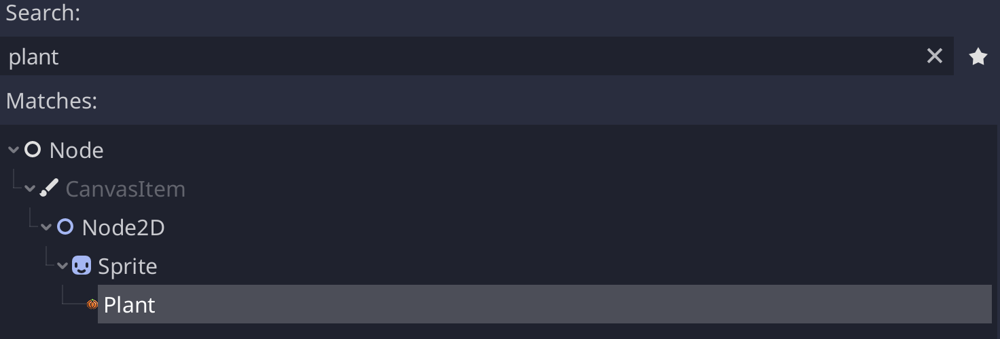

# C# class_name for Godot

In gdscript in Godot, you can use `class_name Name, "res://path/to/icon.png"` and
the class will export into the editor. However, in C# this isn't really possible.

As such, this can be used to work around that issue.

Example:

```csharp
using ClassName.Attributes;
using Godot;

[ClassName, Icon("res://Path/To/PlantIcon.png")]
public class Plant : Sprite
{
    //...
}
```



As you can see here, we have exported the MySprite type and added an icon to it.

Another example:

```csharp
using ClassName.Attributes;
using Godot;

[ClassName, Icon("res://Path/To/Icon.png")]
public class MyResource : Resource
{
    //...
}
```

Reloads happen whenever a resource is saved (though, this is undocumented in Godot so can't guarantee how it works),
or can be done manually in `Project > Tools > Reload C# Resources`.

Since this plugin interacts with the rest of your code, it is required to be referenced in your csproj file.

```xml
<Compile Include="addons/**/*.cs" Condition=" '$(Configuration)' == 'Debug' " />
```

## Thanks To:

- [Spartan322](https://github.com/Spartan322) - For the code review and help cleaning up the API.
